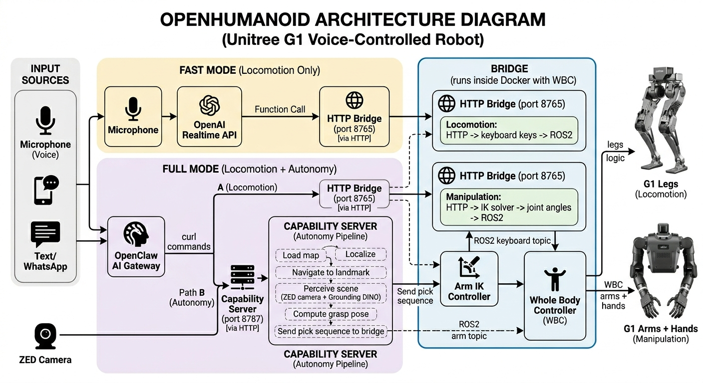

# OpenHumanoid

Voice-controlled humanoid robot integrating **OpenClaw**, **SLAM/LiDAR Navigation**, and **GR00T WBC + VLA** for voice-driven locomotion and loco-manipulation on the Unitree G1.

## Known Gaps (capability stack)

The following gaps remain before the full pick pipeline works on real hardware:

1. **Hands are opt-in on the real robot.** `scripts/start_bridge.sh` keeps `--no-with_hands` as the safe default. That means `hand_controller = None`, `/hand/command` returns 503, and the pick sequence will fail at the gripper step unless you start the bridge with `BRIDGE_WITH_HANDS=1 ./scripts/start_bridge.sh real`.

2. **ZED extrinsics need calibration.** The perception backend supports camera-to-base extrinsics via `ZED_TO_BASE_{X,Y,Z,ROLL,PITCH,YAW}` env vars, but they default to zero. Until calibrated, real object poses will be inaccurate.

3. **Pick sequence blocks the HTTP thread ~5+ seconds.** `_execute_pick_sequence` runs synchronously (~4.5s minimum). Check the timeout on the capability server's bridge call.

4. **Navigation is scaffolded, not wired.** Map build/load/localize/navigate APIs exist and the state machine is complete, but no real LiDAR SLAM or path planner is connected yet.

5. **Face recognition is stubbed.** Enrollment works but recognition returns a hardcoded match — no real face embedding model is wired.

## How It Works

Two switchable voice-control modes, both sharing a single HTTP bridge to the robot:


| Mode                             | Latency | Input                              | Capabilities                                                     |
| -------------------------------- | ------- | ---------------------------------- | ---------------------------------------------------------------- |
| **Fast** (`VOICE_MODE=realtime`) | ~500ms  | Voice (Realtime API)               | Locomotion: walk, turn, stop, distance/timed/sequential commands |
| **Full** (`VOICE_MODE=openclaw`) | ~2-5s   | Voice + Text + WhatsApp (OpenClaw) | Locomotion + prototype map/localize/navigate/perceive/manipulate stack |




See [docs/architecture.md](docs/architecture.md) for the full architecture and data flow, and [docs/capability_stack.md](docs/capability_stack.md) for the new map/localize/navigate/perceive/manipulate control plane.

## Perception Backends

The capability stack supports two real perception backends (plus a mock for development):

| Backend | How it works | When to use |
| ------- | ------------ | ----------- |
| **mock** (default) | Returns hardcoded objects. No camera needed. | Development and testing without hardware |
| **ZED + heuristics** | Live ZED RGB + point cloud. Detects flat surfaces and color-segmentable objects. | Quick smoke test with the camera plugged in |
| **ZED + YOLO** | ZED frames sent to a local YOLO service (`scripts/detector_service.sh`). 2D boxes grounded into 3D via ZED point cloud. | Best accuracy for known object classes, no API cost |
| **ZED + OpenAI VLM** | ZED frames sent to GPT-4o/4.1-mini. Open-vocabulary detection, bounding boxes grounded into 3D. Live-tested end-to-end. | Open-vocabulary queries ("the red mug on the left"), no local GPU needed |

The YOLO and OpenAI VLM backends are both routed through the same HTTP detector service (`scripts/detector_service.py`) and are interchangeable — the 3D grounding and grasp planning pipeline is identical for both.

## Prerequisites

- Python 3.10+
- [uv](https://docs.astral.sh/uv/) (Python package manager)
- Docker (for the WBC container)
- A Unitree G1 robot connected via Ethernet (or use mock mode for dev)
- An [OpenAI API key](https://platform.openai.com/api-keys) with Realtime API access
- A working microphone and speaker (for voice modes)
- **ZED camera perception:** [ZED SDK](https://www.stereolabs.com/developers/release) must be installed on the host (see below)

## Quick Start

### 1. Clone and install

```bash
sudo apt-get install -y libportaudio2
git clone git@github.com:alexzh3/OpenHumanoid.git
cd OpenHumanoid
uv sync
```

### 2. Configure

```bash
cp .env.example .env
# Edit .env and set OPENAI_API_KEY
```

### 3. Set up the WBC (one-time)

```bash
git lfs install
git clone https://github.com/NVlabs/GR00T-WholeBodyControl.git
cd GR00T-WholeBodyControl/decoupled_wbc
./docker/run_docker.sh --install --root    # first time: pulls Docker image
./docker/run_docker.sh --root              # subsequent runs: enters container
```

> Container uses `--network host` so the bridge port (8765) is accessible from the host.
> Container name: `decoupled_wbc-bash-root`.

### 4. Launch bridge + control loop

```bash
# Simulation (MuJoCo)
./scripts/start_bridge.sh

# Real robot, locomotion only
./scripts/start_bridge.sh real

# Real robot, enable hand endpoints for staged pick execution
BRIDGE_WITH_HANDS=1 ./scripts/start_bridge.sh real
```

Verify: `curl http://localhost:8765/status`

Kill bridge: `docker exec decoupled_wbc-bash-root pkill -9 -f run_with_bridge.py`

> **Without Docker/robot:** Run `uv run python bridge/mock_bridge.py` instead. Same API, prints to console.

#### Real robot prerequisites

Before `start_bridge.sh real` will work, the host ethernet NIC must have an IPv4 address on the robot subnet. CycloneDDS (used by the Unitree SDK) ignores interfaces without an IP.

```bash
# 1. Assign IP to the robot NIC (one-time per boot)
sudo ip addr add 192.168.123.222/24 dev enp0s31f6

# 2. Allow DDS multicast traffic through the firewall
sudo ufw allow in on enp0s31f6

# 3. Put the robot in damping mode (L2+B on controller) before launching
```

**Different laptop?** You may need to change the NIC name. Find yours with:

```bash
ip link show          # look for the wired ethernet interface
```

Then either set it inline or export it:

```bash
ROBOT_NIC=eth0 ./scripts/start_bridge.sh real
```

### 4.5. Start the detector service (optional but recommended for real perception)

```bash
# Install the optional detector stack once
uv sync --extra vision

# Run a real detector service (Ultralytics / YOLO)
./scripts/start_detector_service.sh

# Or use an OpenAI vision-language model as the detector backend
DETECTOR_SERVICE_BACKEND=openai DETECTOR_MODEL=gpt-4.1-mini ./scripts/start_detector_service.sh

# Or run the detector service from a fixture file for debugging
DETECTOR_SERVICE_BACKEND=fixture DETECTOR_FIXTURE_PATH=/path/to/detections.json ./scripts/start_detector_service.sh
```

The detector service listens on `http://127.0.0.1:8790/detect` by default and returns 2D detections that the ZED perception backend grounds into 3D.

### 4.6. Start the capability stack

```bash
# Default: mock mode for development (fake perception / verification success)
./scripts/start_capability_server.sh

# Real-backend mode: use the live ZED perception backend by default
CAPABILITY_REAL_BACKEND=1 PERCEPTION_BACKEND=zed ./scripts/start_capability_server.sh

# Real-backend mode with the detector service enabled
CAPABILITY_REAL_BACKEND=1 PERCEPTION_BACKEND=zed DETECTOR_BACKEND=http DETECTOR_URL=http://127.0.0.1:8790/detect ./scripts/start_capability_server.sh

# Force fixture detections instead of the detector service
CAPABILITY_REAL_BACKEND=1 PERCEPTION_BACKEND=zed PERCEPTION_DETECTIONS_PATH=/path/to/detections.json ./scripts/start_capability_server.sh
```

This starts the local capability server used by OpenClaw skills for saved-map navigation, perception, face recognition, and manipulation orchestration. Check `curl -s http://127.0.0.1:8787/status` at any time; the JSON includes `mock_mode`, `perception_backend`, and the active detector backend information.

### 5. Run a voice mode

**Fast mode** (OpenAI Realtime API):

```bash
uv run python -m realtime.main
```

Voice commands:

- "get ready" / "stand up" — activate robot (required first)
- "walk forward" — continuous until "stop"
- "walk forward slowly" / "walk forward fast" — speed control
- "walk forward for 3 seconds" — timed, auto-stops
- "walk forward 2 meters" — distance-based
- "walk forward 1 meter then turn right" — sequential
- "release" / "relax" — toggle hold/limp
- "stop" — immediate halt

**Full mode** (OpenClaw Gateway):

```bash
cd openclaw && bash setup.sh && cd ..
openclaw gateway start
```

Open [http://127.0.0.1:18789](http://127.0.0.1:18789) for WebChat, or use Talk Mode for voice. Supports text and voice via WhatsApp when configured. For autonomy tasks, start the capability stack first so OpenClaw can call the navigation, perception, and manipulation skills.

## Bridge HTTP API


| Method | Endpoint      | Body                                  | Description                                        |
| ------ | ------------- | ------------------------------------- | -------------------------------------------------- |
| POST   | `/move`       | `{"vx": 0.4, "vy": 0.0, "vyaw": 0.0}` | Set velocity (translated to key presses, step=0.2) |
| POST   | `/stop`       | —                                     | Zero all velocities (key `z`)                      |
| POST   | `/activate`   | —                                     | Activate walking policy (key `]`)                  |
| POST   | `/deactivate` | —                                     | Deactivate policy (key `o`)                        |
| POST   | `/key`        | `{"key": "9"}`                        | Publish arbitrary key (e.g. `9` = release/hold)    |
| GET    | `/status`     | —                                     | Current velocity and step size                     |


Speed reference: slow=0.2, medium=0.4, fast=0.6 m/s (1/2/3 key presses).

## Capability Stack API

The prototype autonomy stack runs as a local HTTP server on port `8787` by default. It persists saved maps and exposes higher-level endpoints for map building, localization, navigation, perception, face recognition, and object picking.

Key endpoints:

- `GET  /perception/raw-capture` — returns a PNG image directly from the ZED camera
- `POST /maps/build`
- `POST /maps/load`
- `POST /localization/initialize`
- `POST /navigation/goal`
- `POST /perception/scene`
- `POST /perception/object_pose`
- `POST /perception/grasp_pose`
- `POST /perception/face/enroll`
- `POST /perception/face/recognize`
- `POST /manipulation/pick`
- `POST /mission/pick_object`

See [docs/capability_stack.md](docs/capability_stack.md) for the full contract and the "reach for the table and take the green apple" pipeline. The manipulation path is now pose-aware: perception can return a grasp candidate, and `POST /manipulation/pick` can consume either a raw 3D pose or a precomputed grasp candidate.

## Testing

```bash
# Terminal 1: mock bridge
uv run python bridge/mock_bridge.py

# Terminal 2: test
curl -X POST http://localhost:8765/activate
curl -X POST http://localhost:8765/move -H 'Content-Type: application/json' -d '{"vx": 0.4}'
curl -X POST http://localhost:8765/stop
```

## Planning


| Task                                | Scope  | Description                                         |
| ----------------------------------- | ------ | --------------------------------------------------- |
| **Task 1 — OpenClaw + WBC**         | MVP    | Voice → locomotion pipeline via shared bridge       |
| **Task 2 — SLAM/LiDAR Navigation**  | Tier 2 | Saved-map navigation stack scaffolded; real SLAM/nav adapters still to be wired |
| **Task 3 — VLA + Navigation + WBC** | Tier 3 | Perception/manipulation orchestration scaffolded; real vision and arm control adapters still to be wired |


**Future: GEAR-SONIC integration** — The repo includes NVIDIA's GEAR-SONIC kinematic planner (`gear_sonic_deploy/`) with 27 motion modes (walk, run, squat, crawl, box, dance, zombie walk, etc.). This C++/TensorRT stack accepts commands via ZMQ and could replace or complement the Decoupled WBC for expressive locomotion demos.

## Project Structure

```
OpenHumanoid/
├── bridge/              # Bridge server (run_with_bridge.py for Docker, mock for host)
├── realtime/            # Fast mode: OpenAI Realtime API voice client
├── openclaw/            # Full mode: OpenClaw Gateway config, skills, workspace
├── capabilities/         # Prototype autonomy control plane (navigation/perception/manipulation)
├── scripts/             # Launch and utility scripts (start_bridge.sh, launch.sh)
├── docs/                # Architecture docs and planning assets
├── GR00T-WholeBodyControl/  # NVIDIA WBC repo (gitignored, clone separately)
├── CONTEXT.md           # AI-readable project context
├── .env.example         # Environment variable template
└── pyproject.toml       # Python dependencies (uv sync)
```

## Documentation

- [Architecture & Data Flow](docs/architecture.md)
- [Capability Stack](docs/capability_stack.md)
- [AI Context](CONTEXT.md)
- [Planning Image](docs/planning.png)

## License

TBD