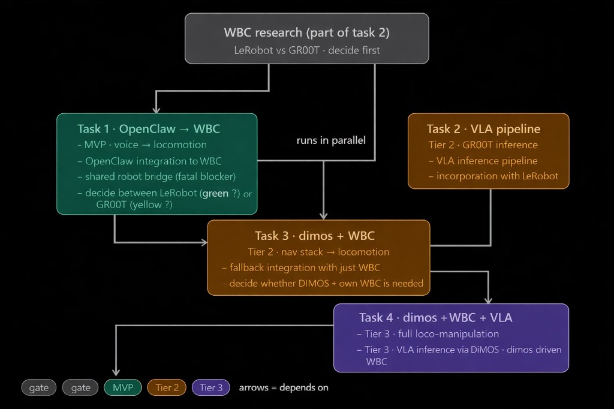

# OpenHumanoid

Voice-controlled humanoid robot integrating **OpenClaw**, **DiMOS**, and **GR00T VLA** for voice-driven locomotion and loco-manipulation on the Unitree G1.

## How It Works

Two switchable voice-control modes, both sharing a single HTTP bridge to the robot:

| Mode | Latency | Input | Capabilities |
|------|---------|-------|-------------|
| **Fast** (`VOICE_MODE=realtime`) | ~500ms | Voice (Realtime API) | Locomotion: walk, turn, stop, distance/timed/sequential commands |
| **Full** (`VOICE_MODE=openclaw`) | ~2-5s | Voice + Text (OpenClaw) | Full orchestration + future DiMOS/VLA |

See [docs/architecture.md](docs/architecture.md) for the full architecture and data flow.

## Prerequisites

- Python 3.10+
- [uv](https://docs.astral.sh/uv/) (Python package manager)
- Docker (for the WBC container)
- A Unitree G1 robot connected via Ethernet/WiFi (or use mock mode for dev)
- An [OpenAI API key](https://platform.openai.com/api-keys) with Realtime API access
- A working microphone and speaker (for voice modes)

## Setup Guide

### Step 1: Install system dependencies and clone

```bash
sudo apt-get install -y libportaudio2   # required by sounddevice for mic/speaker
```

```bash
git clone git@github.com:alexzh3/OpenHumanoid.git
cd OpenHumanoid
uv sync
```

### Step 2: Configure environment

```bash
cp .env.example .env
```

Edit `.env` and set your values:

```
VOICE_MODE=realtime          # "realtime" (fast, locomotion) or "openclaw" (full)
OPENAI_API_KEY=sk-...        # Your OpenAI API key
BRIDGE_URL=http://localhost:8765
```

### Step 3: Set up and run the Decoupled WBC

Full docs: [Decoupled WBC Reference](https://nvlabs.github.io/GR00T-WholeBodyControl/references/decoupled_wbc.html)

**3a. Clone the WBC repository** (one-time setup):

```bash
sudo apt update && sudo apt install git git-lfs
git lfs install

# From inside the OpenHumanoid repo root
git clone https://github.com/NVlabs/GR00T-WholeBodyControl.git
cd GR00T-WholeBodyControl/decoupled_wbc
```

> The cloned repo is already in `.gitignore` so it won't be committed.

**3b. Start the Docker environment** (run from inside `decoupled_wbc/`):

```bash
# First time: install the Docker image (pulls from docker.io/nvgear)
./docker/run_docker.sh --install --root

# Subsequent runs: re-enter the container
./docker/run_docker.sh --root
```

> The container uses `--network host` by default, so port 8765 for our bridge is automatically accessible from the host.
>
> The container is named `decoupled_wbc-bash-root` by default.

**3c. Launch the control stack** (inside the container):

For simulation:

```bash
python decoupled_wbc/control/main/teleop/run_g1_control_loop.py
```

For the real robot (host machine must have static IP `192.168.123.222`, subnet `255.255.255.0`):

```bash
python decoupled_wbc/control/main/teleop/run_g1_control_loop.py --interface real
```

**3d. Verify keyboard control works** (optional but recommended):

With the control loop running, these keyboard shortcuts should work in the terminal:

| Key | Action |
|-----|--------|
| `]` | Activate policy |
| `o` | Deactivate policy |
| `9` | Release / hold the robot |
| `w` / `s` | Move forward / backward |
| `a` / `d` | Strafe left / right |
| `q` / `e` | Rotate left / right |
| `z` | Zero navigation commands |
| `1` / `2` | Raise / lower base height |

Once keyboard control works, the bridge server will use the same underlying ROS2 topics.

### Step 4: Start the bridge server (inside Docker)

Copy the bridge script into the running container and start it:

```bash
# From your host machine (in a separate terminal, from the OpenHumanoid repo root)
WBC_CONTAINER=decoupled_wbc-bash-root
docker cp bridge/bridge_server.py $WBC_CONTAINER:/tmp/bridge_server.py
docker exec $WBC_CONTAINER bash -c "source /opt/ros/humble/setup.bash && python3 /tmp/bridge_server.py --port 8765"
```

You should see:

```
[bridge_server] Bridge HTTP server listening on 0.0.0.0:8765
```

Verify from the host:

```bash
curl http://localhost:8765/status
# Should return: {"ok": true, "last_cmd": {"vx": 0.0, "vy": 0.0, "vyaw": 0.0}, ...}
```

**Monitor incoming commands** (open in a separate terminal):

```bash
# Watch the ROS2 nav commands being published
docker exec -it $WBC_CONTAINER bash -c "source /opt/ros/humble/setup.bash && ros2 topic echo /nav_cmd"

# Or check the last received command at any time
curl http://localhost:8765/status
```

> **Without the robot (mock mode):** Skip steps 3-4 and run the mock bridge on your host instead:
> ```bash
> uv run python bridge/mock_bridge.py
> ```
> Same HTTP API, prints commands to console. Everything else works the same.

### Step 5: Run a voice mode

**Fast mode** -- OpenAI Realtime API (low-latency locomotion):

```bash
uv run python -m realtime.main
```

Speak commands like:
- "walk forward" -- continuous until you say "stop"
- "turn left slowly" -- qualitative speed control
- "walk forward for 3 seconds" -- timed, auto-stops
- "walk forward 2 meters" -- distance-based, duration computed from speed
- "walk forward 1 meter then turn right" -- sequential, executed in order
- "stop" -- immediately halts any movement (including mid-sequence)

All timed/distance movements are interruptible -- say "stop" or a new command and the robot halts immediately.

**Full mode** -- OpenClaw Gateway (full orchestration + TTS):

```bash
# First-time setup only
cd openclaw && bash setup.sh && cd ..

# Start the gateway
openclaw gateway start
```

Then open http://127.0.0.1:18789 for WebChat, or use Talk Mode for voice input/output. OpenClaw processes commands through the `robot_control` skill, which sends curl requests to the bridge.

### Testing the pipeline

Quick end-to-end test with mock bridge:

```bash
# Terminal 1: start mock bridge
uv run python bridge/mock_bridge.py

# Terminal 2: send a test command
curl -X POST http://localhost:8765/move \
  -H 'Content-Type: application/json' \
  -d '{"vx": 0.3, "vy": 0.0, "vyaw": 0.0}'

# Terminal 1 should show: [MOCK] MOVE  vx=0.30  vy=0.00  vyaw=0.00
```

### Bridge HTTP API reference

| Method | Endpoint | Body | Description |
|--------|----------|------|-------------|
| POST | `/move` | `{"vx": 0.3, "vy": 0.0, "vyaw": 0.0}` | Set velocity (auto-clamped to safe range) |
| POST | `/stop` | (none) | Stop all movement immediately |
| POST | `/key` | `{"key": "w"}` | Emulate keyboard press (w/a/s/d/q/e/z) |
| GET | `/status` | -- | Current velocity, limits |

## Planning



| Task | Scope | Description |
|------|-------|-------------|
| **Task 1 — OpenClaw + WBC** | MVP | Voice → locomotion pipeline via shared bridge |
| **Task 2 — VLA Pipeline** | Tier 2 | GR00T inference pipeline |
| **Task 3 — DiMOS + WBC** | Tier 2 | Navigation stack → locomotion |
| **Task 4 — DiMOS + WBC + VLA** | Tier 3 | Full loco-manipulation |

## Project Structure

```
OpenHumanoid/
├── bridge/              # HTTP→ROS2 bridge (runs in Docker or mock on host)
├── realtime/            # Fast mode: OpenAI Realtime API voice client
├── openclaw/            # Full mode: OpenClaw Gateway config + skills
├── scripts/             # Launch and utility scripts
├── docs/                # Architecture docs and planning assets
├── CONTEXT.md           # AI-readable project context
├── .env.example         # Environment variable template
└── pyproject.toml       # Python project config (uv sync)
```

## Documentation

- [Architecture & Data Flow](docs/architecture.md) — how the pipeline works
- [AI Context](CONTEXT.md) — structured project context for coding agents
- [Planning Image](docs/planning.png) — task dependency graph

## License

TBD
