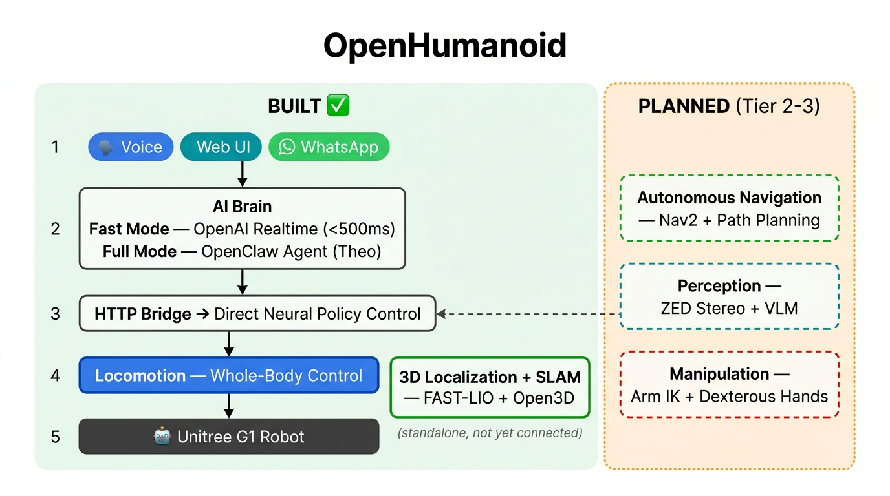
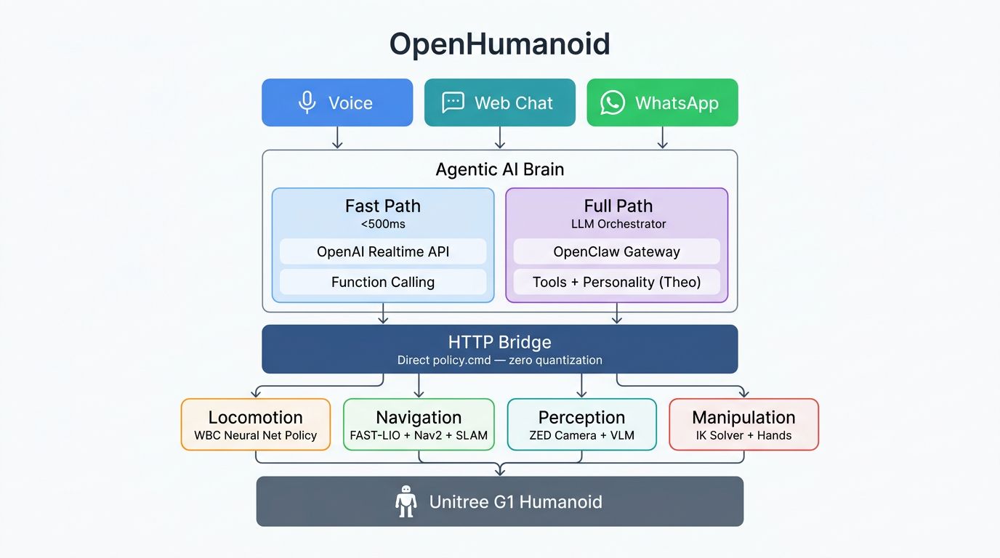

# OpenHumanoid

Open-source agentic AI framework for voice-controlled humanoid robots. Currently running **voice-driven locomotion** on the **Unitree G1** via **OpenClaw** and **GR00T Whole-Body Control**.

> Fork of [alexzh3/OpenHumanoid](https://github.com/alexzh3/OpenHumanoid) — built during **HACK2026 Hackathon** (ETH Robotics Club, 2nd place). This fork adds **hybrid deployment** (WBC on Jetson, voice client on laptop), WiFi-resilient networking, and numpy-safe bridge responses.



## What's Changed in This Fork

- **Hybrid deployment**: WBC runs natively on the Jetson Orin NX, voice client stays on the laptop. Separate repo: [robot-openhumanoid](https://github.com/marinmarian/robot-openhumanoid)
- **WiFi-resilient voice client**: HTTP connection pooling, automatic retries, and WebSocket reconnect with exponential backoff (`realtime/client.py`)
- **Bridge fixes**: `Content-Length` header for HTTP/1.0 responses, numpy-aware JSON serializer for WBC policy values
- **Configurable timeouts**: `BRIDGE_TIMEOUT` and `BRIDGE_RETRIES` environment variables for tuning over unreliable networks

## Hybrid Deployment (Jetson Orin NX)

Run the bridge + WBC directly on the robot's onboard Jetson Orin NX, while keeping the voice client on your laptop. Motor commands execute locally on the robot — no Ethernet round-trip.

```
Laptop (WiFi)                         Robot (Jetson Orin NX)
┌──────────────────┐                  ┌──────────────────────────┐
│ Voice Client     │── HTTP/WiFi ──→  │ Bridge + WBC  :8765      │
│ (mic, speaker)   │                  │ (direct motor control)   │
└──────────────────┘                  └──────────────────────────┘
```

The Jetson-side code lives in a separate, lightweight repo: **[robot-openhumanoid](https://github.com/marinmarian/robot-openhumanoid)**. It contains only the bridge server, launch script, and setup script — no voice client or OpenClaw.

### One-time Jetson setup

```bash
git clone https://github.com/marinmarian/robot-openhumanoid.git
cd robot-openhumanoid
bash scripts/setup.sh
```

This installs GR00T-WholeBodyControl, creates a conda `wbc` environment (Python 3.10), installs ROS2 Humble via RoboStack, and all WBC dependencies.

### Launch

```bash
# Terminal 1 — on the robot (SSH)
conda activate wbc
cd ~/robot-openhumanoid && ./scripts/start.sh

# Terminal 2 — on your laptop
cd OpenHumanoid
uv run python -m realtime.main
```

Set `BRIDGE_URL=http://192.168.123.164:8765` in your `.env` (already done if you cloned this fork).

Verify: `curl -s http://192.168.123.164:8765/status | python3 -m json.tool`

---

## Original Hackathon Team

- [@alexzh3](https://github.com/alexzh3)
- [@Kotochleb](https://github.com/Kotochleb)
- [@RoksolanaMazurak](https://github.com/RoksolanaMazurak)
- [@RybOlya](https://github.com/RybOlya)
- [@Simoneutili](https://github.com/Simoneutili)
- [@VictoriaStarynchuk](https://github.com/VictoriaStarynchuk)

## How It Works

Two switchable voice-control modes, both sharing a single HTTP bridge to the robot:

| Mode                             | Latency | Input                              | Capabilities                                             |
| -------------------------------- | ------- | ---------------------------------- | -------------------------------------------------------- |
| **Fast** (`VOICE_MODE=realtime`) | ~500ms  | Voice (Realtime API)               | Locomotion: walk, turn, stop, distance/timed/sequential  |
| **Full** (`VOICE_MODE=openclaw`) | ~2-5s   | Voice + Text + WhatsApp (OpenClaw) | Locomotion with personality (Theo), multi-channel access  |

See [docs/architecture.md](docs/architecture.md) for the full architecture and data flow.

## Prerequisites

- Python 3.10+
- [uv](https://docs.astral.sh/uv/) (Python package manager)
- Docker (for the WBC container — only needed for local deployment, not hybrid)
- A Unitree G1 robot connected via Ethernet (or use mock mode for dev)
- An [OpenAI API key](https://platform.openai.com/api-keys) with Realtime API access
- A working microphone and speaker (for voice modes)

## Quick Start

### 1. Clone and install

```bash
sudo apt-get install -y libportaudio2
git clone git@github.com:marinmarian/OpenHumanoid.git
cd OpenHumanoid
uv sync
```

### 2. Configure

```bash
cp .env.example .env
# Edit .env and set OPENAI_API_KEY
```

### 3. Set up the WBC (one-time)

```bash
git lfs install
git clone https://github.com/NVlabs/GR00T-WholeBodyControl.git
cd GR00T-WholeBodyControl/decoupled_wbc
./docker/run_docker.sh --install --root    # first time: pulls Docker image
./docker/run_docker.sh --root              # subsequent runs: enters container
```

> Container uses `--network host` so the bridge port (8765) is accessible from the host.
> Container name: `decoupled_wbc-bash-root`.

### 4. Launch bridge + control loop

```bash
# Simulation (MuJoCo)
./scripts/start_bridge.sh

# Real robot
./scripts/start_bridge.sh real
```

Verify: `curl http://localhost:8765/status`

Kill bridge: `docker exec decoupled_wbc-bash-root pkill -9 -f run_with_bridge.py`

> **Without Docker/robot:** Run `uv run python bridge/mock_bridge.py` instead. Same API, prints to console.

#### Real robot prerequisites

Before `start_bridge.sh real` will work, the host ethernet NIC must have an IPv4 address on the robot subnet. CycloneDDS (used by the Unitree SDK) ignores interfaces without an IP.

```bash
# 1. Assign IP to the robot NIC (one-time per boot)
sudo ip addr add 192.168.123.222/24 dev enp0s31f6

# 2. Allow DDS multicast traffic through the firewall
sudo ufw allow in on enp0s31f6

# 3. Put the robot in damping mode (L2+B on controller) before launching
```

**Different laptop?** You may need to change the NIC name. Find yours with:

```bash
ip link show          # look for the wired ethernet interface
```

Then either set it inline or export it:

```bash
ROBOT_NIC=eth0 ./scripts/start_bridge.sh real
```

### 5. Run a voice mode

**Fast mode** (OpenAI Realtime API):

```bash
uv run python -m realtime.main
```

Voice commands:

- "get ready" / "stand up" — activate robot (required first)
- "walk forward" — continuous until "stop"
- "walk forward slowly" / "walk forward fast" — speed control
- "walk forward for 3 seconds" — timed, auto-stops
- "walk forward 2 meters" — distance-based
- "walk forward 1 meter then turn right" — sequential
- "release" / "relax" — toggle hold/limp
- "stop" — immediate halt

**Full mode** (OpenClaw Gateway):

```bash
cd openclaw && bash setup.sh && cd ..
openclaw gateway start
```

Open [http://127.0.0.1:18789](http://127.0.0.1:18789) for WebChat, or use Talk Mode for voice. Supports text and voice via WhatsApp when configured.

## Bridge HTTP API

Base URL: `http://localhost:8765` (configurable via `BRIDGE_PORT`)

Velocities are written directly to the WBC neural network policy — any float value is accepted, no quantization.

### Locomotion

| Method | Endpoint      | Example                                                                                                              | Description                                                        |
| ------ | ------------- | -------------------------------------------------------------------------------------------------------------------- | ------------------------------------------------------------------ |
| POST   | `/move`       | `curl -s -X POST http://localhost:8765/move -H 'Content-Type: application/json' -d '{"vx":0.4,"vy":0.0,"vyaw":0.0}'` | Set velocity `[vx, vy, vyaw]` directly on `policy.cmd`             |
| POST   | `/stop`       | `curl -s -X POST http://localhost:8765/stop`                                                                         | Zero all velocities                                                |
| POST   | `/activate`   | `curl -s -X POST http://localhost:8765/activate`                                                                     | Activate walking policy                                            |
| POST   | `/deactivate` | `curl -s -X POST http://localhost:8765/deactivate`                                                                   | Deactivate policy                                                  |
| POST   | `/key`        | `curl -s -X POST http://localhost:8765/key -H 'Content-Type: application/json' -d '{"key":"9"}'`                     | Send a raw key event (`9`=release/hold, `1`/`2`=base height, etc.) |

Speed reference: slow=0.2, medium=0.4, fast=0.6 m/s.

### Status

| Method | Endpoint  | Description                                                              |
| ------ | --------- | ------------------------------------------------------------------------ |
| GET    | `/status` | Returns current velocity, actual `policy.cmd`, and `policy_connected` flag |

```bash
curl -s http://localhost:8765/status | python3 -m json.tool
```

## Testing

```bash
# Terminal 1: mock bridge
uv run python bridge/mock_bridge.py

# Terminal 2: test
curl -X POST http://localhost:8765/activate
curl -X POST http://localhost:8765/move -H 'Content-Type: application/json' -d '{"vx": 0.4}'
curl -X POST http://localhost:8765/stop
```

## Roadmap

| Task                                | Status       | Description                                            |
| ----------------------------------- | ------------ | ------------------------------------------------------ |
| **Task 1 — OpenClaw + WBC**         | **Done**     | Voice -> locomotion pipeline via shared bridge          |
| **Task 2 — SLAM/LiDAR Navigation**  | Scaffolded   | 3D localization built (FAST-LIO + Open3D), not yet connected |
| **Task 3 — VLA + Navigation + WBC** | Planned      | Perception, manipulation, VLA integration               |

See [docs/README_future.md](docs/README_future.md) for details on planned features.



## Project Structure

```
OpenHumanoid/                          (this repo — laptop side)
├── bridge/              # Bridge server (run_with_bridge.py for Docker, mock for host)
├── realtime/            # Fast mode: OpenAI Realtime API voice client
├── openclaw/            # Full mode: OpenClaw Gateway config, skills, workspace
├── scripts/             # Launch and utility scripts
├── docs/                # Architecture docs, planning assets, roadmap
├── GR00T-WholeBodyControl/  # NVIDIA WBC repo (gitignored, clone separately)
├── CONTEXT.md           # AI-readable project context
├── .env.example         # Environment variable template
└── pyproject.toml       # Python dependencies (uv sync)

robot-openhumanoid/                    (separate repo — Jetson side)
├── bridge/run_with_bridge.py   # Bridge + WBC control loop
├── scripts/setup.sh            # One-time Jetson setup (conda, ROS2, deps)
└── scripts/start.sh            # Launch script
```

## Documentation

- [Architecture & Data Flow](docs/architecture.md)
- [Planned Features & Roadmap](docs/README_future.md)
- [AI Context](CONTEXT.md)

## License

MIT — see [LICENSE](LICENSE) for details.
