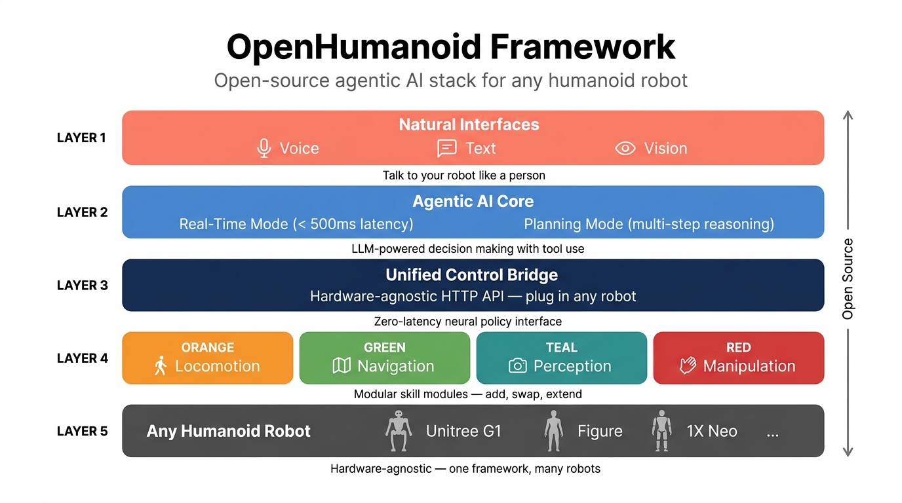

# OpenHumanoid — Planned Features & Roadmap

This document covers features that are scaffolded in the codebase but **not yet fully implemented or tested**. The working system (voice-driven locomotion via Realtime API and OpenClaw) is documented in the main [README](../README.md).



## Tier 2 — Navigation

### 3D Localization + SLAM (built, standalone)

A separate `localization` branch contains a working FAST-LIO + Open3D pipeline for 3D mapping and localization. It runs in its own Docker container (`fast_lio_loc`) but is **not yet connected** to the main locomotion stack.

Components:
- **FAST-LIO**: LiDAR-Inertial Odometry for building 3D point cloud maps
- **Open3D Localization**: ICP matching against saved PCD maps
- **Nav2 Stack**: ROS2 navigation framework, publishes `/cmd_vel`

### Saved-Map Navigation (scaffolded)

The capability stack (`capabilities/server.py`) includes a full state machine for map-based navigation:

- `POST /maps/build` — start building a 3D map
- `POST /maps/load` — load a previously saved map
- `POST /localization/initialize` — initialize localization against the loaded map
- `POST /navigation/goal` — navigate to a named landmark or pose
- `POST /navigation/cancel` — cancel active navigation

The API contract and state machine are complete, but no real LiDAR SLAM or path planner backend is wired yet.

### cmd_vel Bridge (proposed)

A `cmd_vel_bridge.py` ROS2 node to subscribe to Nav2's `/cmd_vel` topic and forward velocities to the HTTP bridge's `/move` endpoint, closing the loop between autonomous navigation and locomotion.

## Tier 2 — Perception

### Perception Backends

The capability stack supports multiple perception backends (plus a mock for development):

| Backend              | How it works                                                                                                            | When to use                                                              |
| -------------------- | ----------------------------------------------------------------------------------------------------------------------- | ------------------------------------------------------------------------ |
| **mock** (default)   | Returns hardcoded objects. No camera needed.                                                                            | Development and testing without hardware                                 |
| **ZED + heuristics** | Live ZED RGB + point cloud. Detects flat surfaces and color-segmentable objects.                                        | Quick smoke test with the camera plugged in                              |
| **ZED + YOLO**       | ZED frames sent to a local YOLO service (`scripts/detector_service.sh`). 2D boxes grounded into 3D via ZED point cloud. | Best accuracy for known object classes, no API cost                      |
| **ZED + OpenAI VLM** | ZED frames sent to GPT-4o/4.1-mini. Open-vocabulary detection, bounding boxes grounded into 3D. Live-tested end-to-end. | Open-vocabulary queries ("the red mug on the left"), no local GPU needed |

The YOLO and OpenAI VLM backends are both routed through the same HTTP detector service (`scripts/detector_service.py`) and are interchangeable.

### Detector Service Setup

```bash
uv sync --extra vision

# YOLO backend
./scripts/start_detector_service.sh

# OpenAI VLM backend
DETECTOR_SERVICE_BACKEND=openai DETECTOR_MODEL=gpt-4.1-mini ./scripts/start_detector_service.sh

# Fixture file for debugging
DETECTOR_SERVICE_BACKEND=fixture DETECTOR_FIXTURE_PATH=/path/to/detections.json ./scripts/start_detector_service.sh
```

The detector service listens on `http://127.0.0.1:8790/detect` by default.

### Perception Endpoints

- `GET  /perception/raw-capture` — returns a PNG image directly from the ZED camera
- `POST /perception/scene` — scene understanding
- `POST /perception/object_pose` — 3D object localization
- `POST /perception/grasp_pose` — grasp candidate generation
- `POST /perception/face/enroll` — face enrollment
- `POST /perception/face/recognize` — face recognition (currently stubbed)

**Prerequisite:** [ZED SDK](https://www.stereolabs.com/developers/release) must be installed on the host, plus `pyzed` Python bindings.

## Tier 3 — Manipulation

### Upper Body Control (arm + hand)

The bridge includes endpoints for arm IK and hand control, but hands are **not yet ready on the real robot**.

| Method | Endpoint                      | Body                                                                                      | Description                                                             |
| ------ | ----------------------------- | ----------------------------------------------------------------------------------------- | ----------------------------------------------------------------------- |
| POST   | `/arm/pose`                   | `{"active_arm":"right", "wrist_pose":[x,y,z,qw,qx,qy,qz], "move_time_s":1.5}`            | Move wrist to a Cartesian target via IK                                 |
| POST   | `/hand/command`               | `{"active_arm":"right", "posture":"grasp", "gripper_width":0.08}`                         | Open/close hand. Postures: `open`, `release`, `close`, `grasp`          |
| POST   | `/manipulation/pick_sequence` | `{"active_arm":"right", "pregrasp_pose":[...], "grasp_pose":[...], "retreat_pose":[...]}` | Staged pick: open hand, pregrasp, descend, close hand, retreat          |

Requires launching the bridge with `BRIDGE_WITH_HANDS=1 ./scripts/start_bridge.sh real`.

### Pick Pipeline

`POST /manipulation/pick` and `POST /mission/pick_object` orchestrate the full pick sequence: perception locates the target, computes a grasp pose, then commands the arm through pregrasp/grasp/retreat stages.

## Tier 3 — VLA Integration

Vision-Language-Action model integration for grounded, perception-driven manipulation. The orchestration layer is scaffolded in the capability stack but no real VLA model is connected.

## Capability Stack

The full capability stack runs as a local HTTP server (`capabilities/server.py`) on port `8787`:

```bash
# Mock mode (default)
./scripts/start_capability_server.sh

# Real backends
CAPABILITY_REAL_BACKEND=1 PERCEPTION_BACKEND=zed ./scripts/start_capability_server.sh

# With detector service
CAPABILITY_REAL_BACKEND=1 PERCEPTION_BACKEND=zed DETECTOR_BACKEND=http DETECTOR_URL=http://127.0.0.1:8790/detect ./scripts/start_capability_server.sh
```

Check status: `curl -s http://127.0.0.1:8787/status`

See [capability_stack.md](capability_stack.md) for the full API contract.

## GEAR-SONIC

The GR00T-WholeBodyControl repo includes **GEAR-SONIC** (`gear_sonic_deploy/`), a C++/TensorRT kinematic planner with 27 motion modes:

| Category | Modes |
|----------|-------|
| Locomotion | idle, slowWalk, walk, run |
| Ground | squat, kneelTwoLeg, kneelOneLeg, lyingFacedown, handCrawling, elbowCrawling |
| Boxing | idleBoxing, walkBoxing, leftJab, rightJab, randomPunches, leftHook, rightHook |
| Styled walks | happy, stealth, injured, careful, objectCarrying, crouch, happyDance, zombie, point, scared |

GEAR-SONIC accepts commands via a ZMQ interface (`mode`, `movement_direction`, `facing_direction`, `speed`, `height`). It cannot run simultaneously with the Decoupled WBC (both write motor commands), but could serve as an alternative locomotion backend for expressive demos.

## Known Gaps

1. **Hands are opt-in on the real robot.** `scripts/start_bridge.sh` keeps `--no-with_hands` as the safe default. `/hand/command` returns 503 unless started with `BRIDGE_WITH_HANDS=1`.
2. **ZED extrinsics need calibration.** Camera-to-base extrinsics default to zero (`ZED_TO_BASE_{X,Y,Z,ROLL,PITCH,YAW}` env vars). Until calibrated, 3D object poses will be inaccurate.
3. **Pick sequence blocks the HTTP thread.** `_execute_pick_sequence` runs synchronously (~4.5s minimum).
4. **Navigation backends not wired.** Map/localize/navigate APIs exist and the state machine is complete, but no real SLAM or path planner is connected.
5. **Face recognition is stubbed.** Enrollment works but recognition returns a hardcoded match.
